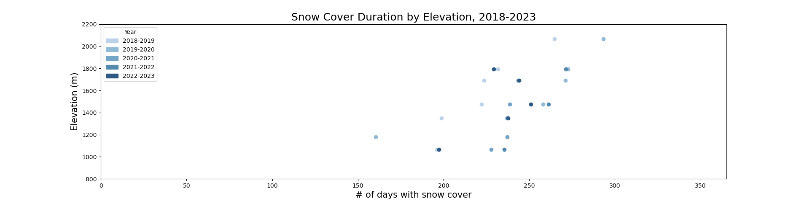

# Daily Logbook for Zara

___________________________________________________________________________________________________________

## 27 July: snow days/season vs peak snow water equivalent at Marten Ridge, Schrieber's Meadow estimate

### snow days/season vs peak snow water equivalent at Marten Ridge
one measurement of snow is the peak snow water equivalent in a year (provided by SNOTEL). this is correlated with the number of snow days and the season length (defined here as number of days between first snowfall and snowmelt, inclusive), which are really just two slightly different measurements of how long it snowed for. Here's both of those graphs:

**Peak snow water equivalent vs NUMBER OF SNOW DAYS**

**Peak snow water equivalent vs SEASON LENGTH**

### Schrieber's Meadow estimate
_r^2 of the NUMBER OF SNOW DAYS graph is higher than that of the SEASON LENGTH graph, so that was the one I used for estimating peak snow water equivalent at Schrieber's Meadow_

**Marten Ridge shares surprising similarities with Schrieber's Meadow (within 30 ft in elevation apart and facing roughly the same aspect), making them excellent comparisons to each other.**

Here's an estimate of peak snow water equivalent at Schrieber's Meadow based on the number of snow days (as derived from iButtons data, taking into account **both near-zero temperatures and low variance)**, using the SWE/ # snow day trendline from Marten Ridge. See the faint labeled y-values:

___________________________________________________________________________________________________________

## 26 July: snow season length vs snowfall amount, UW reflection

### snow season length vs snowfall amount
well this is not actually total snowfall because I just added up everything, but the SNOTEL graph is not a graph of the new precipitation of each day, but rather the cumulative snowfall/snowmelt of that [day] :)

[day]: # (great work on this. I am so impressed. Can you make the font a bit larger on everything?)

**# of snow days vs "snow amount"**

**length of snow season vs "snow amount"**

### UW reflection
* I talked to around five people, ranging from undergraduate to graduate level
* one interesting question I got asked was, if I can change how the sensors are deployed, what would I change?
  * buried sensors often got lost because they are marked with orange tape, but some hikers mark their trash with the same tape
  * tree (exposed) sensors are facing various directions which gets us inconsistent solar radiation data
* one person suggested I compare my snow extent data to SNOWTEL (one of my observations was that 2018-19 might have been a lighter snow year)
* another person suggested I put trendlines on my scatterplot to see if I can compare the slopes (snow day increase for elevation) between the years
* I would like to try out both suggestions above, as well as implement the variance calculation that I didn't get to do beforehand

___________________________________________________________________________________________________________

## 20 July: completed snow cover duration graphs

### methods for identifying days with snow cover
* my current method accounts only for near-zero temperatures and not for daily temperature variance, which means I inadvertently count the days where temperatures might be near freezing but there isn't snow cover
* **next steps: employ Tanvi G.'s variance/standard deviation analysis to more accurate identify days with snow cover**

### completed snow duration graphs

**Q: what is the threshold for identifying snow cover? Should slight inaccuracies in the sensor be accounted for?** See difference in graph for Value = 0 vs. Value >= -1 && Value <= 1:

___________________________________________________________________________________________________________

## 19 July: 2022-2023 data!

### deriving graphs
intermediary steps:
* plotted concatenated data by site
* scatter plot of dates when value(temp) = 0
* multi-series scatter plot of different sites
* multi-series scatter plot with elevation
  * for elevation, I used caltopo.com and GPS data from 2019 (I could have found elevation with GPS data from 2019 and 2021 averaged, as they were in slightly different formats, but 2021 lacked a location for site 7 so I stuck to 2019 for consistency's sake. The elevations derived from the two years were never more than 20 feet apart anyway)
  * I named the data files for different sites with the site number as well as the elevation, so I can strip the elevation from the name of the file in my code

* **next steps: consider adding to concatenator.py the ability to name .pkl files with their elevation based on site name**

### 2020 sensors 1 & 3 mix up solved
* 2020 group logged iButton 1 as "buried" and iButton 3 as "tree (assumed shaded)". 2021 group reported retrieving iButton 3 in iButton 1's spot and vice versa. 
* Data from the two sensors were initially organized into site directories according to 2020's installation data, although a note was made of 2021's collection notes.
* When all data from site1_buried had been concatenated and graphed, it was clear that 2020 iButton 1 had been a mistake, as **there was no snow cover apparent**:
.

* however, **data from iButton 1 is very similar to tree(shaded) data from other years**. Take this example from tree(shaded) 2018-2019:

From this, I concluded that **2020 iButton 1 is likely tree(shaded) and iButton 3 was buried**, matching 2021 group's collection notes.
All relevant data files, tables, and concatenated frames have been updated.

**All 2022-2023 sensors were successfully saved in csv files (see my [MtBakerData](./MtBakerData) directory)**
* packed into .pkl files, both .csv and .pkl versions sorted into site directories and pushed to team's repositories
* other notes:
  * iButton 8 — battery died
  * iButton 12 from 2021 retrieved
* all 2023 logbook information were recorded and added to iButton tables

### processing 2022-2023 csv files
For whatever reason, the time (incorrectly labeled as the "Unit") column contains weird (non-alphanumeric) characters, which prevented them from being converted to datetime format.
* solved by using pandas to find the characters and removing them.
* otherwise the process went similar to 2021-2022 files --> both batches had misnamed columns

### 2023-2024 logbook anomalies
* iButtons 2-7 (site 1) — site instructions called for 5 tree (exposed) and 1 tree (shaded), but all 6 were tree (exposed) at completely different heights than any other year, and there was no tree (shaded) sensor installed
* iButton 11 (site 3) — logged as tree (exposed) but site instructions called for tree (shaded);
* iButtons 13, 14, 15 (site 5) — location recorded as 48 44 11 N 121 50 29 W, but was 48 44 1 N 121 50 29 W for every other year
* iButton 18 (site 9) — only location info is “crater rim”, no installation data, no GPS. **can I assume lat/long from 2018 and 2019 logbooks by matching site number?**
* iButton 20 (site 9) — only location info is “in the mount baker dox/dot at summit”, no installation data, no GPS. **can I assume lat/long from 2018 and 2019 logbooks by matching site number?**

___________________________________________________________________________________________________________

## 18 July: Data wrangling, pkl files

### Problem with data being structured differently
For whatever reason, some data files have columns that are in the wrong format, with "Date/Time" for date, "Unit" for time, "Value" for Celsius (irrelevant), and no index for temperature. This was the root of 95% of errors in [data_file_to_pkl.py](./data_file_to_pkl.py)

**process:**
* simply renaming the indices was unsuccessful because there were numerous errors that essentially all complained about replacing 3 indices with 4.
  * solved by resetting the indices completely and applying 4 new indices "Date", "ts", "Value", and "Temp" before combining and dropping any columns
* all the different-header-value-for-different-files were just side effects from pandas being confused by 3 indices with 4 columns of data and thinking the date column is the name of the row
* same with 'OutOfBounds nanosecond timestamp' error, which is likely pandas trying to convert just the "ts" column into datetime after thinking "Date" is the name of the row
  * **next step (if time): remove obsolete error work-arounds/safeguards**, such as `errors = "coerce"`
* instead of detecting whether there are 3 or 4 columns of data after putting them into dataframes, it was read directly from the original csv files instead.
  * the data files were then processed differently depending on the number of columns, due to the extra renaming step if there were 4
* code ignores the first 14 rows of the data file, which contain info about the sensor that is not part of the data
* some kind of unicode error that occured occasionally, haven't figured out wh)t's causing it

**IMPORTANT: all data files were stripped to just the necessary (a 'datetime' index and a 'Value" temperature column) and packed into pkl files to retain the dataframe structure (and be easily read back in) for later use**

**pkl files have been sorted into directories by site (exactly like the original files) for easier concatenation and ready to be shared with teammates**

### To-Do
* concatenating all the data from buried sensors
* generate 5-year span graphs
* ~push prepared pkl files to teammates' repositories~
* share pkl unpacking code with teammates

___________________________________________________________________________________________________________

## 17 July: Concatenating data (continued), plotting

### Problem with 2019 sensors 9 and 10 (site 5 west slope vs ridge)
2019 sensors 9 and 10 were given the same lat/long in the logbook with no additional site description, making it difficult to find which one was at west slope and which one at top ridge. The only way to distinguish them would be by looking at the data itself.

I decided to **graph the west slope and top ridge sensors from 2018** to find any patterns that might be comparable to 2019 sensors 9 and 10. Here's what I got:
* West Slope: 
* Top Ridge: 

As Dr. Town predicted, **the snow cover at top ridge went away much [earlier] than that at west slope**. With this information, I can graph 2019 sensors 9 and 10 in the same way and **pretty safely assume that the one with earlier snowmelt was the one at top [ridge]**.
* 2019 sensor 9: 
* 2019 sensor 10: 

Since snow cover as indirectly measured by 2019 sensor 10 went away much earlier than that by sensor 9, I'm going to conclude that **sensor 9 was at west slope and sensor 10 was at top ridge**.

Now we are able to concatenate their data to the right dataframes.

### Plotting
* code now works to plot a time vs temperature graph
  * reads csv into dataframe
  * drops irrelevant columns
  * re-formats 'Date/Time' string into data of type datetime
  * sets datetime as index
  * plots graph with index for x and Value (temperature) for y

### Concatenating data
* ~working to create folders for each site so code can simply loop through the folder~ **done, and pushed to teammates' directories :)**
* **next step: concatenate data for site 1 buried**

### 2023 data
* [java] and OneWire are set up, 2023 data are ready to be read into csv files

[earlier]: # (Ok, well I have filled my quota for being right this month. Now on to you to be right!!!)
[java]: # (wow. thank you.)
[ridge]: # (can you use relative path names for images? this way I can see the plots on my end.)
___________________________________________________________________________________________________________

## 14 July: Concatenating data, identifying relevant sensors for snow extent

### Problems
* **2020 sensors 2 and 4 were snag sensors placed at different heights than any other year ([163 and 190] cm respectively, compared to 50-100-150-200-230). Is this trivial enough that we can round them to 150 and 200?**
* **2019 sensors 9 and 10 were given the same coords with no additional site description, making them indistinguishable between site 5 west slope vs top ridge. Sensor 11 is assumed to be east slope only because its coords were NE of the coord given for 9 and 10**
  * the only way to tell might be through the data --> **if there was a layer of snow covering both sensors at some point, the one at top ridge likely melted/went away faster due to windier conditions**

Helpful website for finding altitude from lat/long: [caltopo.com](caltopo.com) map
* elevation we got from Google Maps is being checked for a 2nd time by Kaiden using caltopo for the sake of consistency and accuracy.

### Look at data for Mt. Baker temperature
* for day hike!

### modifying table to include more specific data
* Concatenating the data across the years is helpful so that we can refer to just one file for all the data at a single location/depth/height. Can be thought of as data that we would have gotten if we had one 5-year sensor in that location
* our tables do not currently specify the height and depth at which the sensors were buried
  * need to make this distinction at least for **tree(exposed)** category --> the series of sensors at different heights of the snag
    * the depth for the buried category does not need to be specified for now. they are all around the same anyway and it's just one of many other variables that are hard to keep consistent
* table should have a new column that specifies the height and depth
  * this way we do not need to hard code the list of corresponding censors, instead we can just read in from the spreadsheet
* site 5 specifically should be separated into **west slope, east slope, and top ridge**

### site 5, microclimates, and additional information
* table categorizes all three site 5 sensors as **buried** and did not make the distinction between their slightly different microclimates
* site 5 sensors were placed at west ridge (grassy), ridge top (windy), and east ridge (glacial/mars)
  * data from these three sensors can be compared to study microclimates
* **for research into snow extent, the sensor at buried at west ridge would probably be the best "macro-scale" representation of site 5 according to Dr. Town**
  * all other sites of the sensors were selected to be a macro-scale representation of their respective biomes too, so the data can pick up on the differences across them
* **next step: account for microclimates in the table**

### future research questions
* what different types of microclimates are on Mt. Baker?
* **how does snow interact differently with each microclimate?** (really interesting)
  * the darker the surface the faster the snow melts (reflectivity)
  * when there's a deep layer of snow it doesn't really matter, but when it begins to thin out, the rate at which the snow melts on surfaces varies greatly
    * ex. snow melts faster on pavement than it does on grass

### [Group tasks]
* concatenate data across the years, in an intuitive order (by site? by individual research questions?)
  * each group member concatenates a different set of data so we have more progress
    * I believe Noah is currently working on 2021-22 sensors #3-7 (the snag)
    * **next step (for me): concatenate data for the buried sensors by elevation (from low to high)**
 

 [163 and 190]: # (let's keep it as accurate as we can. The lapse rate can be sensitive near the surface.)
[Group tasks]: # (Great logbook entries)
___________________________________________________________________________________________________________

## 13 July: Data munging and logbooks (continued)

Group is working together to organize our data into better formats (plotting a map, transcribing to Google Sheets)

### Group to-do list
* ~Finish logbook v2~
  * ~separate pages for each year~
* verify iButton table 
* ~lat/long conversion (if time, today)~
  * **next step: location consistency between coords**
* plotted maps for each year
* updating notes + assumptions file
  * turn into markdown file
* import function for iButtons
  * convert time values to "datetime"
* finding altitude from lat/long

### Lat/long consistency
* latitude/longitude conversion: there is bound to be some discrepancy when converting between the different formats
* **Q: what is the threshold we set for identifying whether two lat/long measurements are actually refering to the same location?**
  * might just have to use best judgement and check logbook for site number
  * can average the lat/long coords
* we have converted all coords to **degree-minute-second format**
  * **next step: location consistency (see question)**

### Finding altitude from lat/long
* We're doing this manually via Google Maps --> not efficient and prone to human error
* **some altitudes we found via Google Maps are inconsistent with what was recorded in the logbooks**
  * inconsistencies highlighted in red in the spreadsheet

### Things to investigate
* when the 2021 group collected the 2020 sensors, they reported finding sensor 1 in 3's spot and 3 in 1's spot
  * **next steps: we can identify what happened when analyzing the data later, because one was supposed to be buried and the other on a tree and [shaded]**

[shaded]: # (let's start concatenating and plotting the data at each level. Create a pkl and csv file for each level. Focus on the levels that you will use for your question. )
___________________________________________________________________________________________________________

## 12 July: Data munging and logbooks

The iButton sensors were not installed in consistent locations from year to year between 2018-2022 --- for example, in some years sensor 3 replaced sensor 1, and we can only tell by checking the logbook.

### Google Sheets matching locations and sensors between the years ([spreadsheet](https://docs.google.com/spreadsheets/d/1rYSfCRtbOYoHYn_85mbR3-nh_1uO19BrHjO-JNV4u0A/edit?usp=sharing))
* columns and rows are organized by year and location respectively
* number in individual cells represent the iButton # at the corresponding year and location
* this can help us easily track iButton switches/changes at any particular location

### Plotting sensor location using My Map
* each sensor location was marked with a pin at the long/lat indicated by the logbooks
* pins were categorized into tree (shaded), tree (exposed), and buried
  * My Map allows the user to select and unselect the categories, which could be very helpful if we ever want to identify just one type of sensor.
* five maps total, one for each year
* makes it easier to visually understand where the sensors are
* **next steps: finish the maps**

### Keeping track of notes and assumptions ([doc](https://docs.google.com/document/d/1t3DZDcdIQ3F8V3vs7w8JFYGRBkURkfGAyaJHBlQ6oHY/edit?usp=sharing))
* some logbooks had many pieces of missing information, such as location and installation data
* I am able to fill in most of the missing information by refering to any notes made and/or the logbooks of the consecutive years, but **all such assumptions need to be recorded in case we later run into inconsistent data**

### Logbooks "Version 2"
* original logbooks messy and hard to keep track of
* we are transcribing and organizing all the information into Google Sheets to make it easier to plot the map
  * iButtons are organized by #
  * any missing location/installation data are filled in to the best of our ability (and any assumptions/additional notes recorded)
* **next steps: finish Logbooks Version 2**
* **collection notes are made by the group of the *following year*, upon retrieving the sensors installed in the *current year* of the logbook!!!**
  * **next steps: go back and re-evaluate location/installation assumptions**
  * finished up till 2020
* **there is some confusion for 2020 iButtons 1 & 3; 2021 group reported finding 3 in 1's spot and 1 in 3's spot**

Additional notes:
* would be great to have one place for all of our files
* **Q: where to draw the line for reasonable vs unreasonable assumptions?**
___________________________________________________________________________________________________________

## 11 July: Understanding [paper about snow cover](https://github.com/ESR-LSRI/MtBakerClimate/blob/main/docs/references/Lundquist_Lott_Tsnow_2008WR007035.pdf), introduction to research questions

### Understanding "Using inexpensive temperature sensors to monitor the duration and heterogeneity of snow-covered areas"
Near-surface soil usually experience diurnal (read: daytime) temperature changes, but not when it is covered by a layer of snow (serves as insulator, and sends infrared light back to space). Thus, sensors placed in near-surface soil can indirectly measure snow cover using temperature data by analyzing the time elapsed between periods of diurnal temperature changes combined with air temperature record and snow melt data.

### RQ 1: What is the lapse rate (how temperature changes with height) on Mt. Baker? How does this change with season? (Felicity indicated interest)
* 5 years of data from iButtons to work with
* Many factors affect lapse rate, such as moisture and cloud cover
* the lapse rate we calculate would be empirical and can be compared with the theoretical lapse rate derived by ERA5 (some kind of model)
* Q: if our results are inconsistent with that of ERA5, which do we trust?

### RQ 2: What is the seasonal snow extent on Mt. Baker? Has this changed over the instrument record? (my interest here)
* snow cover paper relevant
* data lacking for the south side of Mt Baker
* can indirectly measure snow cover via near-surface soil temperatures --- 0 degrees Celsius or below indicate that there is snow cover (when ground warming the snow and melted snow cooling the ground reach an equilibrium?)
* the snow cover days we observe can be compared with data from ERA5
* **next steps: visualization of snow cover duration vs elevation over the course of 5 years**
  * [Tanvi's data visualization showing snow cover duration by elevation for 1 year](https://resources.finalsite.net/images/f_auto,q_auto/v1595276787/lakeside/pcvib3itvln0ceohblhw/FIg2_tanvi.png)
  * scatter plot, each color representing one winter --> see if there's any trend
  * Q: Over the course of 5 years, has there been a change in snow cover duration on the south side of Mt Baker? (3 graphs? 1 graph?)
    * date of snowfall onset? **next steps: define onset (search up standard/commonly-accepted definition)**
    * date of snowmelt? **same as above**
* **Q: How do I figure out which sensors are relevant for this question as well as their elevation?** 
  * **next steps: check logbooks**
    * buried vs tree (only buried is relevant for this right?)
  * is there a map that shows the location/elevation of the sensors visually?

### RQ 3: How sunny is it at Schrieber's Meadow (the lowest instrument site)? Has this changed over the instrument record? (Noah or Kaiden)
### RQ 4: What is the seasonal snow depth at Schrieber's Meadow in 2021-2022? (Noah or Kaiden)

___________________________________________________________________________________________________________

## 10 July: Learning how to read papers, and the stuff I learned from one [particular paper](https://github.com/ESR-LSRI/MtBakerClimate/blob/main/docs/references/Lundquist_Huggett_Tintrees_2008WR006979.pdf)

Going into this I didn't have much background knowledge on meterology/glaciology/oceanography, so I found some of the papers a difficult read due to the terminology used and the fancy language :D. It looks more complicated than it actually is, so I know that as long as I can put what I learned into my own words it makes more sense.

### Understanding "[Evergreen trees as inexpensive radiation shields for temperature sensors](https://github.com/ESR-LSRI/MtBakerClimate/blob/main/docs/references/Lundquist_Huggett_Tintrees_2008WR006979.pdf)"
I was initially confused on how this paper helps me with understanding how to use data from the sensors, because I expected more like an instruction sheet. After conferring with Dr. Town, I understood that the paper is actually addressing how putting the sensors under Evergreen trees helps us monitor the temperature without the influence of the sun's radiation, and that Evergreen trees serve as a good enough radiation shield. 

This is important as monitoring the temperature changes of Mt. Baker is a significant part of our research question, so ensuring that the data we gather from the sensors are accurate is of the utmost importance.

Next steps: read the abstracts of the two other papers provided and understand their significance to our research. I am especially interested in the snow one.

[particular paper]: # (great work identifying your gaps in knowledge and what you need to do to fill them.)

___________________________________________________________________________________________________________

## Date: Topic(s) of the day

Your daily log book should include the following contents:
* Questions you were asking/tasks you needed to complete
* Details on your approach to those questions/task
* A summary of outcomes (e.g. answers, numbers, graphs, intermediate products)
* Your next steps
* Questions you have for your peer(s) and/or instructor(s) 

*each of the topics below should contain a complete summary as detailed above*

This is a [link](https://www.markdownguide.org/basic-syntax) markdown syntax. Thanks for learning this!

### Topic/question/task 1
Summary of question/task
details of approach
summary of outcomes
next steps
questions
